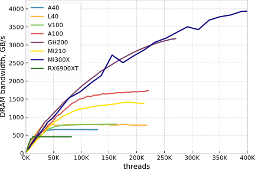
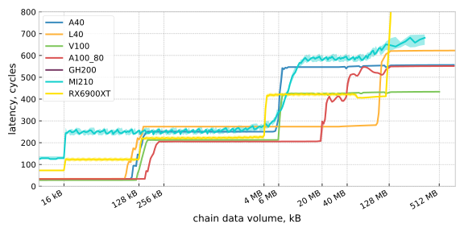
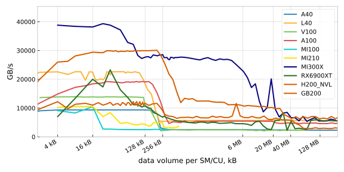
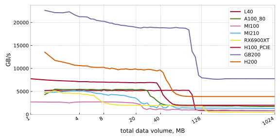

# GPU benchmarks
This is a collection of GPU micro benchmarks. Each test is designed to test a particular scenario or hardware mechanism. Some of the benchmarks have been used to produce data for these papers:

["Analytical performance estimation during code generation on modern GPUs" ](https://doi.org/10.1016/j.jpdc.2022.11.003)

["Performance engineering for real and complex tall & skinny matrix multiplication kernels on GPUs"](http://dx.doi.org/10.1177/1094342020965661)


Benchmarks that are called ```gpu-<benchmarkname>``` are hipifyable! Whereas the default Makefile target builds the CUDA executable ```cuda-<benchmarkname>```, the target ```make hip-<benchmarkname>``` uses the hipify-perl tool to create a file ```main.hip``` from the ```main.cu``` file, and builds it using the hip compiler. The CUDA main files are written so that the hipify tool works without further intervention. 

Also have a look at the [gpu-metrics](gpu-metrics) functions, which provide a concise way of measuring hardware performance counter metrics of a kernel launch inside the running program. 

If any of this is useful, stars and citations are welcome!


## gpu-stream

Measures the bandwidth of streaming kernels for varying occupancy. A shared memory allocation serves as a spoiler, so that only two thread blocks can run per SM. Scanning the thread block size from 32 to 1024 scans the occupancy from 3% to 100%.


Kernel | Formula |   |
-------|----------|---|
init  | A[i] = c  |   1 store stream
read | sum = A[i] |   1 load stream
scale | A[i] = B[i] * c |   1 load stream, 1 store stream
triad | A[i] = B[i] + D[i] * C[i] |  3 load streams, 1 store stream
3pt | A[i] = B[i-1] + B[i] + B[i+1] |  1 load streams, 1 store stream
5pt | A[i] = B[i-2] + B[i-1] + B[i] + B[i+1] + B[i+2] |  1 load streams, 1 store stream


The results for the SCALE kernel and a selection of GPUs:



Note that the H100 results are for the PCIe version, which has lower DRAM bandwidth than the SXM version!

## gpu-latency

Pointer chasing benchmark for latency measurement. A single warp fully traverses a buffer in random order. A partitioning scheme is used to ensure that all cache lines are hit exactly once before they are accessed again. Latency in clock cycles is computed with the current clock rate.



Sharp L1 cache transitions at 128/192/256 kB for NVIDIAS V100/A100/H100 and at 16kB for AMD's MI210. V100 and MI210 both have a 6MB L2 cache. The A100's and H100 have a segmented L2 cache at 2x20MB and 2x25MB, which manifests as a small intermediate plateau when data is fetched from the far L2 section. 

The RDNA2 GPU, the RX6900XT, has the most interesting cache hierarchy with its 4 cache levels are clearly visible: the 16kB L0 cache, the 128kB semi-shared L1 cache, the 4MB L2 cache, and the 128MB Infinity cache. It is also the highest clocking GPU, so that the absolute access times would be lower than the other GPUs. Measuring its DRAM latency is difficult, because the DRAM interface does not clock up for a single wavefront, resulting in DRAM latencies > 2000 cycles. 
## gpu-cache

Measures bandwidths of the first and second cache level. Launches one thread block per SM. Each thread block repeatedly reads the contents of the same buffer. Varying buffer sizes changes the targeted cache level.



The 16kB (MI100/MI210), 128kB (V100), 192kB (A100) and 256 kB (H100) L1 cache capacities are very pronounced and sharp. The three NVIDIA architectures both transfer close to 128B/cycle/SM, the maximum measured value on AMD's MI100 and MI210 depends on the data type. For double precision, the maximum is 32B/cycle/CU. For single precision and 16B data types (either float4 or double2) the bandwidth is up to 64B. 

This benchmark does not target the memory hierarchy levels past the second cache level (i.e. DRAM for most GPUs), because the data sets do not clearly drop out of a shared cache. Because all thread blocks read the same data, there is a lot of reuse potential inside shared cache before the data is evicted. The RX6900XT values are bonkers past its 128kB shared L1 cache. A100 and H100 drop slightly at 20/25MB, when the capacity of a single cache section is exceeded. Beyond this point, data cannot be replicated in both L2 cache sections and the maximum bandwidth drops, as data has also to be fetched from the other section.

## gpu-l2-cache

Measures bandwidths of shared cache levels. This benchmark explicitly does not target the L1 caches.



All three GPUs have a similar L2 cache bandwidths of about 5.x TB/s, though with different capactities. 

A remarkable observation is the RX6900XT, which has a second shared cache level, the 128MB Infinity Cache. At almost 1.92 TB/s, it is as fast as the A100's DRAM.
At the very beginning, the RX6900XT semi-shared L1 cache can be seen, where for some block placements the 4 L1 caches have a small effect. 
The same applies to the H100, which has a larger L1 cache with an increased chance for a thread block to find the data it wants to work on already in the L1 cache loaded in by the previous thread block. This only works for the small data sets, where there are only a few different data blocks and this chance is still significant. This is not attributable to the Distributed Shared Memory Network, that allows to load from other SM's shared memory, because it only works for explicit shared memory loads and not global loads. This would require tag checking every L1 cache in the GPC for any load. 


## gpu-strides

Read only, L1 cache benchmark that accesses memory with strides 1 to 128. The bandwidth is converted to Bytes per cycle and SM. The strides from 1 to 128 are formatted in a 16x8 tableau, because that highlights the recurring patterns of multiples of 2/4/8/16. 


These multiples are important for NVIDIA's architecture, which clearly have their L1 cache structured in a 16 banks of 8B. For strides that are a multiple of 16, every single thread accesses data from the same cache bank. The rate of address translation is reduced when addresses do not fall into the same 128B cache line anymore.

AMD's MI210 appears to have even more banks, with especially stark slowdowns to less than 4B/cycle for multiples of 32. 

Testing the stencil-like, 2D structured grid access with different thread block shapes reveals differences in the L1 cache throughput:


(see the generated machine code of MI210 and A100 here: https://godbolt.org/z/1PvWqs9Kf)

AMD's MI210 is fine (at its much lower level), as long as contiguous blocks of at least 4 threads are accessed. NVIDIA's only reach their maximum throughput for 16 wide thread blocks. 

Along with the L1 cache size increass, both Ampere and Hopper also slightly improve the rate of L1 cache address lookups. 

## gpu-small-kernels

This benchmark explors the potential for cache blocking, where kernels work on a small data set that fits into caches. Because the data set is small, and the L2 cache is fast, the kernel executues so quickly that the startup overhead of a kernel launch becomes dominant. The benchmark queues 10000 calls of a streaming SCALE kernel of varying size. Use commandline option "-graph" to use the cudaGraph/hipGraph API. 


Each device gets a fit of \$a,b\$ for the function

$$T = \frac{V}{a + V/b}$$

which models the performance with a startup overhead \$a\$ and a bandwidth \$b\$ depending on the data volume \$V\$. 

## cuda-roofline

This program scans a range of Computational Intensities, by varying the amount of inner loop trips.  It is suitable both to study the transition from memory- to compute bound codes as well as power consumption, clock frequencies and temperatures when using multiple GPUs. The shell script series.sh builds an executable for each value, and executes them one afer another after finishing building.

The Code runs simultaneously on all available devices. Example output on four Tesla V100 PCIe 16GB:

```console
1 640 blocks     0 its      0.125 Fl/B        869 GB/s       109 GF/s   1380 Mhz   138 W   60°C
2 640 blocks     0 its      0.125 Fl/B        869 GB/s       109 GF/s   1380 Mhz   137 W   59°C
3 640 blocks     0 its      0.125 Fl/B        869 GB/s       109 GF/s   1380 Mhz   124 W   56°C
0 640 blocks     0 its      0.125 Fl/B        869 GB/s       109 GF/s   1380 Mhz   124 W   54°C

1 640 blocks     8 its      1.125 Fl/B        861 GB/s       968 GF/s   1380 Mhz   159 W   63°C
0 640 blocks     8 its      1.125 Fl/B        861 GB/s       968 GF/s   1380 Mhz   142 W   56°C
2 640 blocks     8 its      1.125 Fl/B        861 GB/s       968 GF/s   1380 Mhz   157 W   62°C
3 640 blocks     8 its      1.125 Fl/B        861 GB/s       968 GF/s   1380 Mhz   144 W   59°C
[...]
0 640 blocks    64 its      8.125 Fl/B        811 GB/s      6587 GF/s   1380 Mhz   223 W   63°C
3 640 blocks    64 its      8.125 Fl/B        813 GB/s      6604 GF/s   1380 Mhz   230 W   66°C
1 640 blocks    64 its      8.125 Fl/B        812 GB/s      6595 GF/s   1380 Mhz   241 W   71°C
2 640 blocks    64 its      8.125 Fl/B        813 GB/s      6603 GF/s   1380 Mhz   243 W   69°C
```


## cuda-memcpy

Measures the host-to-device transfer rate of the cudaMemcpy function over a range of transfer sizes

Example output for a Tesla V100 PCIe 16GB
``` console
         1kB     0.03ms    0.03GB/s   0.68%
         2kB     0.03ms    0.06GB/s   5.69%
         4kB     0.03ms    0.12GB/s   8.97%
         8kB     0.03ms    0.24GB/s   6.25%
        16kB     0.04ms    0.44GB/s   5.16%
        32kB     0.04ms    0.93GB/s   2.70%
        64kB     0.04ms    1.77GB/s   5.16%
       128kB     0.04ms    3.46GB/s   7.55%
       256kB     0.05ms    5.27GB/s   1.92%
       512kB     0.07ms    7.53GB/s   1.03%
      1024kB     0.11ms    9.25GB/s   2.52%
      2048kB     0.20ms   10.50GB/s   1.07%
      4096kB     0.37ms   11.41GB/s   0.58%
      8192kB     0.71ms   11.86GB/s   0.44%
     16384kB     1.38ms   12.11GB/s   0.14%
     32768kB     2.74ms   12.23GB/s   0.03%
     65536kB     5.46ms   12.29GB/s   0.08%
    131072kB    10.89ms   12.32GB/s   0.02%
    262144kB    21.75ms   12.34GB/s   0.00%
    524288kB    43.47ms   12.35GB/s   0.00%
   1048576kB    86.91ms   12.35GB/s   0.00%
```

## um-stream

Measures CUDA Unified Memory transfer rate using a STREAM triad kernel. A range of data set sizes is used, both smaller and larger than the device memory. Example output on a Tesla V100 PCIe 16GB:

```console
 buffer size      time   spread   bandwidth
       24 MB     0.1ms     3.2%   426.2GB/s
       48 MB     0.1ms    24.2%   511.6GB/s
       96 MB     0.1ms     0.8%   688.0GB/s
      192 MB     0.3ms     1.8%   700.0GB/s
      384 MB     0.5ms     0.5%   764.6GB/s
      768 MB     1.0ms     0.2%   801.8GB/s
     1536 MB     2.0ms     0.0%   816.9GB/s
     3072 MB     3.9ms     0.1%   822.9GB/s
     6144 MB     7.8ms     0.2%   823.8GB/s
    12288 MB    15.7ms     0.1%   822.1GB/s
    24576 MB  5108.3ms     0.5%     5.0GB/s
    49152 MB 10284.7ms     0.8%     5.0GB/s
```


## cuda-incore

Measures the latency and throughput of FMA, DIV and SQRT operation. It scans combinations of ILP=1..8, by generating 1..8 independent dependency chains, and TLP, by varying the warp count on a SM from 1 to 32. The final output is a ILP/TLP table, with the reciprocal throughputs (cycles per operation):

Example output on a Tesla V100 PCIe 16GB:

``` console
DFMA
  8.67   4.63   4.57   4.66   4.63   4.72   4.79   4.97
  4.29   2.32   2.29   2.33   2.32   2.36   2.39   2.48
  2.14   1.16   1.14   1.17   1.16   1.18   1.20   1.24
  1.08   1.05   1.05   1.08   1.08   1.10   1.12   1.14
  1.03   1.04   1.04   1.08   1.07   1.10   1.11   1.14
  1.03   1.04   1.04   1.08   1.07   1.10   1.10   1.14

DDIV
111.55 111.53 111.53 111.53 111.53 668.46 779.75 891.05
 55.76  55.77  55.76  55.76  55.76 334.26 389.86 445.51
 27.88  27.88  27.88  27.88  27.88 167.12 194.96 222.82
 14.11  14.11  14.11  14.11  14.11  84.77  98.89 113.00
  8.48   8.48   8.48   8.48   8.48  50.89  59.36  67.84
  7.51   7.51   7.51   7.51   7.51  44.98  52.48  59.97

DSQRT
101.26 101.26 101.26 101.26 101.26 612.76 714.79 816.83
 50.63  50.62  50.63  50.63  50.62 306.36 357.38 408.40
 25.31  25.31  25.31  25.31  25.31 153.18 178.68 204.19
 13.56  13.56  13.56  13.56  13.56  82.75  96.83 110.29
  9.80   9.80   9.80   9.80   9.80  60.47  70.54  80.62
  9.61   9.61   9.61   9.61   9.61  58.91  68.72  78.53
```

Some Features can be extracted from the plot.

Latencies:
 - DFMA: 8 cycles
 - DDIV: 112 cycles
 - DSQRT: 101 cycles
 
Throughput of one warp (runs on one SM quadrant), no dependencies:
 - DFMA: 1/4 per cycle (ILP 2, to ops overlap)
 - DDIV: 1/112 per cycle (no ILP/overlap)
 - DSQRT: 1/101 per cycle (no ILP/overlap)
  
Throughput of multiple warps (all SM quadrants), dependencies irrelevant:
 - DFMA: 1 per cycle 
 - DDIV: 1/7.5 cycles
 - DSQRT: 1/9.6 cycles
 


